# AgentRunner Technical Documentation

## Overview

`AgentRunner` is the core orchestration engine for agentic LLM workflows. It manages the complete lifecycle of agent execution including iterative LLM interactions, tool invocation routing between external and MCP-based tools, approval caching, and comprehensive observability through OpenTelemetry tracing.

## Architecture

The runner implements a controlled execution loop that alternates between LLM inference and tool execution until either a final response is produced or external tool approval is required. Tool calls are prioritized by weight, with only the highest priority tier executed in each iteration to ensure critical operations are handled before proceeding.

## Core Components

### Tool Management

Tools are registered from two sources: external tools provided at runtime and MCP tools discovered through the connection interface. Each tool receives an agentic name prefixed by its server kind (`ext_` or `mcp_`) to avoid naming collisions. The tool registry maintains:

- Priority levels for execution ordering
- Approval requirements and cache status
- Input schemas for validation
- Server kind classification (external vs MCP)

### Approval System

When approval tools are configured, the runner consults an approval cache before each execution loop to determine which tools can be invoked without human intervention. Tools marked as requiring approval but found in the cache with positive approval are automatically enabled. This allows progressive automation as approvals accumulate over time.

### Execution Flow

The runner accepts either initialization requests with a fresh user message or resume requests with external tool results. Both flow into the same execution loop which runs until one of three conditions:

- The LLM produces a validated final response
- External tools require user action
- The maximum iteration limit is reached

Each iteration constructs context through the provided builder, invokes the LLM with available tools, and processes the response. If the LLM returns text, optional output validation runs before completion. If tool calls are requested, they are prioritized and split between immediate MCP execution and external tool requests that pause execution.

### Tool Execution Model

MCP tools execute synchronously within the iteration using async parallel invocation. Their results are immediately added to the conversation history before the next LLM call. External tools pause the execution loop and return control to the caller with pending tool requests, allowing for human approval workflows or external system integrations.

Tool validation occurs at two points:

- External tools validate before being queued for execution
- Final responses validate before completion

Validation failures inject corrective feedback into the conversation as user messages, allowing the LLM to retry with proper guidance.

### Observability

Every execution creates an OpenTelemetry span hierarchy with the root agent span containing child spans for LLM calls and tool invocations. The spans follow OpenInference semantic conventions for LLM observability, capturing:

- Full conversation history with role and content tracking
- Tool schemas and invocation parameters
- Token usage metrics (prompt, completion, total)
- Error traces and validation failures
- Lifecycle events and budget status

A parallel streaming system emits structured events at key lifecycle points for real-time monitoring.

## Budget Management

The runner enforces a configurable maximum tool interaction count to prevent runaway execution. Once exhausted, the budget state is passed to validators and context builders, allowing them to adjust behavior. The LLM continues to receive requests even after budget exhaustion, enabling it to produce a final response based on the information gathered.

## Error Handling

Validation errors for both tool inputs and final outputs are non-fatal and converted to user messages with structured feedback. This allows the LLM to self-correct within the iteration budget. Tool execution failures for MCP tools are caught and returned as error results in the conversation. Unrecoverable errors during initialization, cleanup, or LLM inference terminate the execution and propagate to the caller.

## State Management

The runner maintains immutable message history throughout execution, creating new message arrays with each modification. Tool results are appended as user messages with proper tool_use_id references. The conversation structure follows a strict assistant-user alternation pattern where tool calls from the assistant are immediately followed by tool results from the user role.

## Integration Points

The system requires three core integrations:

- **LLM Integration**: Handles inference and returns either text responses or tool requests with usage metrics
- **Context Builder**: Constructs system prompts and manages conversation history based on current state
- **MCP Connection** (optional): Provides server-side tool discovery and execution capabilities

Additional optional integrations include:

- **Approval Cache**: Persistent storage for tool permission decisions
- **Output Validator**: Custom validation logic for final LLM responses
- **Tool Input Validator**: Pre-execution validation for external tool arguments
- **Stream Handler**: Real-time event consumer for monitoring and logging

# AgentRunner `.execute` component interaction diagram

```mermaid
sequenceDiagram
    participant Client
    participant AgentRunner
    participant OTel as OpenTelemetry
    participant Stream as Event Stream
    participant MCP as MCP Connection
    participant Cache as Approval Cache
    participant Context as Context Builder
    participant LLM as LLM Integration
    participant Tools as Tool Registry

    Client->>AgentRunner: execute(param, parentSpan)
    
    activate AgentRunner
    AgentRunner->>OTel: startActiveSpan("AgentRunner.execute")
    activate OTel
    OTel-->>AgentRunner: span + otelInfo
    
    AgentRunner->>Stream: emit('execution.started')
    AgentRunner->>OTel: log("Agent execution started")
    
    Note over AgentRunner: Initialization Phase
    AgentRunner->>AgentRunner: initializeExecution()
    activate AgentRunner
    
    AgentRunner->>Tools: Clear toolRegistry
    AgentRunner->>MCP: connect(otelInfo)
    activate MCP
    MCP-->>AgentRunner: connected
    deactivate MCP
    
    AgentRunner->>MCP: getTools(otelInfo)
    activate MCP
    MCP-->>AgentRunner: mcpTools[]
    deactivate MCP
    
    AgentRunner->>Tools: registerTools(externalTools, 'external')
    AgentRunner->>Tools: registerTools(mcpTools, 'mcp')
    AgentRunner->>OTel: log("Tool registration complete")
    deactivate AgentRunner
    
    Note over AgentRunner: Execution Loop Phase
    AgentRunner->>AgentRunner: runExecutionLoop()
    activate AgentRunner
    
    Note over AgentRunner,Cache: Resolve Tool Approvals
    AgentRunner->>Cache: resolveToolApprovals()
    activate Cache
    
    loop For each tool requiring approval
        Cache->>Cache: Check approval cache
    end
    
    Cache->>Cache: getBatched(toolNames)
    Cache-->>AgentRunner: approvedTools[]
    deactivate Cache
    
    Note over AgentRunner: Main Iteration Loop (max iterations)
    loop Until completion or max iterations
        
        Note over AgentRunner: Check Budget
        alt toolInteractionCount >= maxToolInteractions
            AgentRunner->>Stream: emit('tool.budget.exhausted')
            AgentRunner->>OTel: log(WARNING, "Budget exhausted")
        end
        
        Note over AgentRunner,Context: Build Context
        AgentRunner->>Stream: emit('context.build.started')
        AgentRunner->>Context: buildContext(param, messages, tools)
        activate Context
        Context-->>AgentRunner: {systemPrompt, messages}
        deactivate Context
        AgentRunner->>Stream: emit('context.build.success')
        
        Note over AgentRunner,LLM: Call LLM
        AgentRunner->>OTel: startActiveSpan("Agentic LLM Call")
        AgentRunner->>Stream: emit('llm.call.started')
        
        AgentRunner->>LLM: callLLM(context, tools)
        activate LLM
        LLM->>OTel: Set OpenInference attributes (input)
        LLM->>LLM: Execute LLM inference
        LLM->>OTel: Set OpenInference attributes (output)
        LLM-->>AgentRunner: {response?, toolRequests?, usage}
        deactivate LLM
        
        AgentRunner->>Stream: emit('llm.call.completed')
        
        alt LLM returned final response
            Note over AgentRunner: Validate Response
            AgentRunner->>AgentRunner: integrateLLMResponse(messages, response)
            
            opt outputValidator provided
                AgentRunner->>AgentRunner: outputValidator(response, budget)
                
                alt validation failed
                    AgentRunner->>OTel: log("Response invalid") + exception
                    AgentRunner->>AgentRunner: Add validation error as user message
                    AgentRunner->>AgentRunner: toolInteractionCount++
                    Note over AgentRunner: Continue loop
                else validation passed
                    AgentRunner->>OTel: log("LLM finalized response")
                    AgentRunner-->>Client: SUCCESS {messages, response, toolInteractions}
                end
            end
            
        else LLM requested tools
            AgentRunner->>AgentRunner: toolInteractionCount++
            
            Note over AgentRunner,Tools: Prioritize Tools
            AgentRunner->>AgentRunner: prioritizeToolRequests(toolRequests)
            Note over AgentRunner: Group by priority, select highest
            
            Note over AgentRunner,MCP: Process Tool Requests
            AgentRunner->>AgentRunner: processToolRequests()
            activate AgentRunner
            
            AgentRunner->>OTel: log("LLM requested tool calls")
            
            loop For each tool request
                AgentRunner->>AgentRunner: addToolUseMessage(request)
                AgentRunner->>Tools: lookup tool in registry
                
                alt tool not found
                    AgentRunner->>OTel: exception("Tool does not exist")
                    AgentRunner->>AgentRunner: addToolErrorMessage()
                    
                else tool is MCP
                    AgentRunner->>Stream: emit('tool.mcp.executing')
                    AgentRunner->>MCP: invokeTool(name, arguments)
                    activate MCP
                    
                    alt invocation successful
                        MCP-->>AgentRunner: response
                    else invocation failed
                        AgentRunner->>OTel: log(ERROR, "MCP invocation failed")
                        MCP-->>AgentRunner: error message
                    end
                    deactivate MCP
                    
                    AgentRunner->>AgentRunner: Queue tool result
                    
                else tool is external
                    opt externalToolValidator provided
                        AgentRunner->>AgentRunner: externalToolValidator(name, data, budget)
                        
                        alt validation failed
                            AgentRunner->>OTel: exception(validationError)
                            AgentRunner->>AgentRunner: addToolErrorMessage()
                        else validation passed
                            AgentRunner->>AgentRunner: Queue as external request
                        end
                    end
                end
            end
            
            AgentRunner->>AgentRunner: await all MCP invocations
            AgentRunner->>AgentRunner: addToolResults(mcpResults)
            AgentRunner->>OTel: log("Invoked MCP tools and prepared external tools")
            
            deactivate AgentRunner
            
            alt Has external tool requests
                AgentRunner-->>Client: PENDING {messages, toolRequests, toolInteractions}
            else No external tools, only MCP
                Note over AgentRunner: Continue loop with MCP results
            end
        end
        
    end
    
    Note over AgentRunner: Max iterations reached
    AgentRunner->>AgentRunner: throw Error("Reached maximum hard limit")
    
    deactivate AgentRunner
    
    opt Execution failed
        AgentRunner->>Stream: emit('execution.failed')
        AgentRunner->>OTel: exception(error)
        AgentRunner-->>Client: ERROR thrown
    end
    
    opt Execution succeeded
        AgentRunner->>Stream: emit('execution.completed')
    end
    
    Note over AgentRunner: Cleanup Phase
    AgentRunner->>MCP: disconnect(otelInfo)
    activate MCP
    MCP-->>AgentRunner: disconnected
    deactivate MCP
    
    AgentRunner->>OTel: span.end()
    deactivate OTel
    
    deactivate AgentRunner
    
    AgentRunner-->>Client: Final result
```

