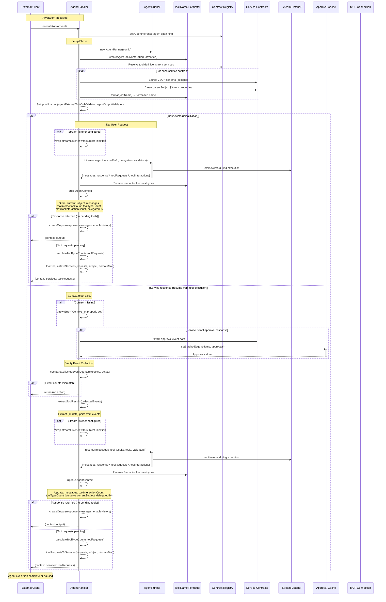

## ArvoAgent - Technical Documentation

The `createAgent` function returns an Arvo resumable orchestrator handler that wraps `AgentRunner` with contract-based service integration, tool name formatting, and event-driven state management.

### Handler Architecture

The handler operates in two distinct modes triggered by the event flow: 

- Initialization mode when processing the first user request
- Resume mode when processing service responses from external tool executions. 

Both modes converge on the same execution engine but differ in how they prepare input and manage context.

### Tool Name Translation

All service contract names undergo bidirectional translation to ensure LLM-compatible formatting. The formatter converts dot-separated contract names (e.g., `weather.forecast`) to underscore format (`weather_forecast`) when presenting tools to the LLM, then reverses this transformation when routing tool requests back to service contracts.

### Contract Integration

Service contracts provided during agent creation are resolved into tool definitions with their JSON schemas extracted and sanitized. The `parentSubject$$` field, used internally by the orchestrator for event correlation, is stripped from tool schemas before presentation to the LLM. When tool requests are converted to service invocations, this field is automatically reinjected with the current orchestration subject.

### Validation Chain

The handler configures two validation points. External tool call validation uses the service contract's accept schema to verify tool arguments before queueing external requests. Output validation uses the agent contract's output format schema to ensure final responses match the expected structure. Both validators return structured errors that the engine converts into corrective feedback for the LLM.

### State Persistence

Agent context flows through the orchestrator's memory system across multiple handler invocations. The context captures the current conversation subject for event correlation, the complete message history for LLM continuity, tool interaction counters for budget tracking, and delegation metadata for multi-agent scenarios. This context enables seamless resumption after external tool executions complete.

### Event Collection Synchronization

When resuming from service responses, the handler verifies that all expected tool results have been collected before proceeding. It compares the tool type counts from the previous execution against the actual collected event counts. If counts mismatch, the handler returns early without invoking the engine, allowing the orchestrator to wait for additional service responses.

### Approval Cache Integration

Tool approval responses receive special handling. When a service response matches the tool approval contract's event type, the handler extracts approval decisions and persists them to the approval cache before normal processing continues. This ensures subsequent executions can automatically authorize previously approved tools without re-prompting.

### Stream Event Decoration

When a stream listener is configured, the handler wraps it to inject the conversation subject into every emitted event. This decoration occurs at the handler boundary rather than within the engine, keeping the engine's streaming interface simple while providing richer context to external listeners.

### Response Construction

Output responses are conditionally structured based on the contract configuration. When message history is enabled, the complete conversation array is included alongside the final output. Otherwise, only the structured output (or simple response string) is returned. This flexibility supports both conversational interfaces that need full context and data extraction workflows that only need final results.

### Service Invocation Mapping

Tool requests are transformed into orchestrator service invocation parameters with proper event correlation. Each request receives its tool use ID as the deduplication value, ensuring idempotent processing if the orchestrator retries. Domain routing information from the service configuration is attached when available, enabling multi-region or multi-tenant deployments.

# Component Interaction Diagram

